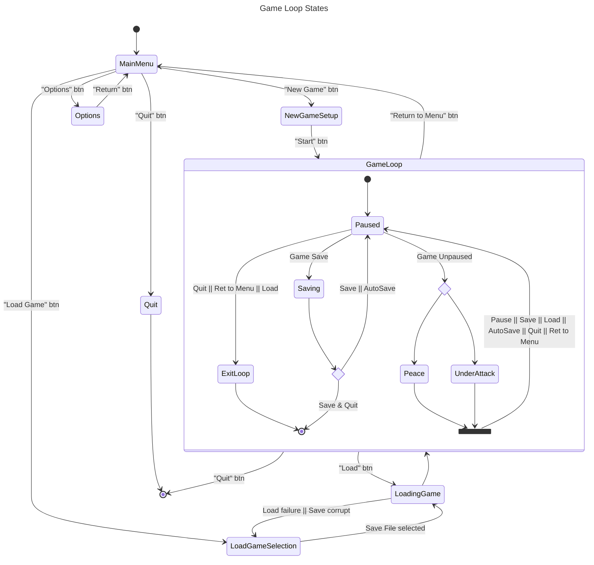
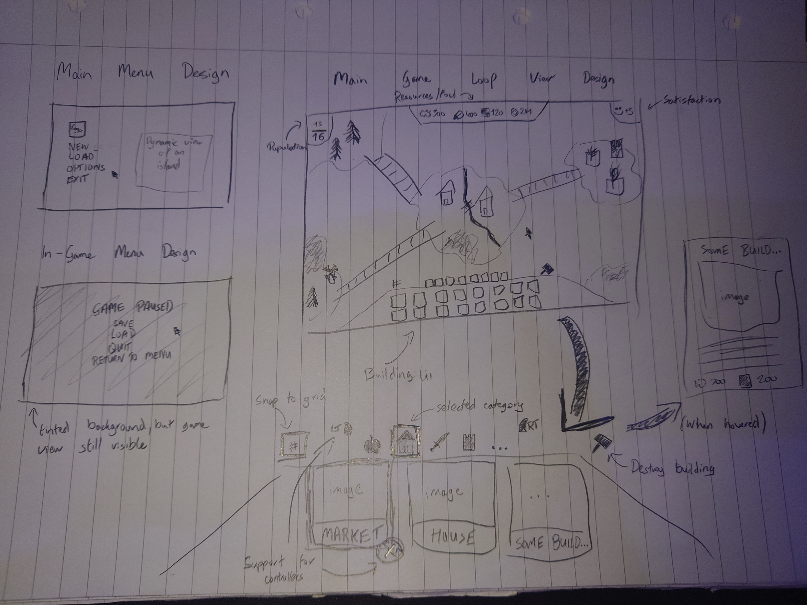

## Target Demographic
Age:
- Primary: 18-45 years old
- Secondary: 12-17 and 46-60 years old

Gender:
- Any gender
- Significant skew to male players based on historical data for strategy games ([Women and Video Games 2017 survey by Quantic Foundry](https://quanticfoundry.com/2017/01/19/female-gamers-by-genre/))

Time Commitment:
- Primarily, low time commitment for shorter games
## Target Style
Most strategic games such as [Stronghold](https://store.steampowered.com/app/2140020/Stronghold_Definitive_Edition/), [Anno](https://store.steampowered.com/app/916440/Anno_1800/) or [Civilization](https://store.steampowered.com/app/289070/Sid_Meiers_Civilization_VI/) aim for a realistic depiction of the world. With this project, I am aiming for a hyper-realistic world rather than realism.

A hyperrealistic poly graphical style also makes it easier to find assets without having to invest too much time.

## Finding a Name
Finding a name for a game is usually very difficult. However, during idea brainstorming, my idea was to base it on flying islands connectable by bridges. This was partially inspired by [The Aether mod](https://modrinth.com/mod/aether) for [Minecraft](https://www.minecraft.net/en-us), as well as a combination of strategy games I play. I have yet to see or play any combination of both of these in a strategic genre.

Since the player is essentially building a ***castle*** in the ***sky***, I have decided to search for names combining the two inspirations, as well as their features.

One of the names I came up with was "Skyward Citadel". After further consideration and research, this name seems to have **no attached public IPs**, or any major google search history related to games. It is also an eye catching title, and rolls off the tongue when pronounced. It achieves all of this while describing the entirety of the game and what it is about.

## Features
#### Main Menu
Base starting point of the game where the player can:
- Create a new game
- Load a game from save file
- Change options
- Quit

#### Core Gameplay
- Resource Gathering
	- Resource Gathering Difficulty
		- Multiplier for how much resource is produced based on gathering (reduces progression speed and increases difficulty)
		- Easy
		- Medium
		- Hard
	- Gathered by building specific resource gathering buildings
	- Bought via a market
	- Resource Types
		- Iron
		- Wood
		- Stone
- Food Gathering
	- Gathered by building specific food gathering buildings
	- Bought via a market
- Basic Economy System
	- Gold
	- Used for bartering items
	- Used
- Basic Population Management System
	- Worker satisfaction
	- Current number of workers
		- Workers slowly arrive if satisfaction is high
	- Max number of workers
		- Increased by building/upgrading housing
	- A worker either has a job assigned or is unemployed
- Building
	- Can be placed in any valid land spot
	- Certain buildings can only occupy certain area
		- For e.g. A stone quarry can only be placed on stone deposit
	- Certain buildings may be upgradable
	- Building Types
		- Housing
			- Increase max workers
		- Resource/Food Gathering
			- Gather Resources & Food
		- Market
			- Barter items
		- Defences (Towers & Walls)
			- Build a basic protection layer
		- Bridges
			- Bridge between multiple islands
- Defence Mode
	- Attack Difficulties
		- Peaceful (attacks disabled)
		- Easy
		- Medium
		- Hard
	- Attacks will come unannounced as raids on the player's island.
	- An attack will never commence in the first few minutes of gameplay. There should be a clear threshold for when the user is somewhat prepared, after which the attack waves will come unannounced.

### Further Expansion
The idea also has a lot of further expansion that can be added to enhance the game loop and immerse the player while retaining their attention.

Some of these may include:
- Controller support for a more laid back playstyle
- Co-operative/Competitive mode against players
	- Diplomacy system for alliances between competitive mode
- Weather system to affect gameplay and looks
- Day/Night Cycle
- Season system to affect gameplay and looks
- Offensive units and buildings for attacking
- Technology Tree to control progression
- Quests & Missions to increase player retention
- Customisation options (changing building colours, etc)
- Fluctuating market prices
- Multiple Z layers (underground and building stacking)
- Natural Disasters
- Mini-games
- Procedural Generation
- Achievements & Challenges
- Mod Support
- Cloud Saving (Steam)

## Design
### Game States

### Basic UI Design!

## Criteria
##### "*Intro screen with keyboard/mouse controls*"
The Main Menu will be the intro screen/entry point of the game.

##### "*Objects using OpenGL primitives with texture coords and normals (at least three objects)*"
Buildings can be considered as objects. Each building will have their respective textures and properties. Each object will also be a normal to the ground/surface it is being placed on. At present based on the plans, there should be a lot of object variety (if we consider each building to be a separate object type).

##### "*New skybox (no seams) and terrain (not stretched)*"
The features don't encapsulate changing the skybox implicitly.

However, the skybox will be changed to be more fitting with the game style.

##### "*Audio*"
The features don't encapsulate audio implicitly.

Certain actions like workers collecting resources will produce audio. Clicking buttons and UI can also produce audio synchronised to actions.

Background audio can be played throughout the game (based on the state of the game such as the attack phase and build phase).

##### "*Head's up display*"
The design encompasses most of the base design of the GUIs. The GUI is designed in a manner which should allow for adding controller support without having to rework the GUI.

##### "*Camera motion technique*"
As much as the design might seem relatively flat and 2D. The general ideology of the game is for it to be 3D with (aprox) a 30* angle (isometric-like) - that way part of the volume of buildings and objects can be seen.

A good example of the intended execution is early versions of Stronghold, which had a very specific camera technique.
![[Pasted image 20241014234806.png]]

Stronghold: Definitive Edition image from [Steam](https://store.steampowered.com/app/2140020/Stronghold_Definitive_Edition/) (screenshot 2 of 8)

##### "*Use of lighting or colouring effects*"
The design has not encompassed lighting. The skybox will be the primary light source.

However, it may be possible to incorporate lights such as fire braziers to fit the game. As an extensions, it may also be possible to incentivise the use of these - such as allowing the player to light areas to increase productivity around them during nightfall.

##### "*Special effects*"
The design has not shown any effects.

During peace time, the islands can have slight buoyancy so they are not static. Some birds and clouds can occasionally fly by the screen in the background.

During the defence, the viewport can shake. For e.g. When cannons fire.

##### "*Game physics*"
Incorporating use of physics will be difficult in this game type.

Physics could mostly be used on objects or actions to improve the fidelity of the game. For e.g. A worker mining, where the particles would use physics. Or as another example, the tree leaves moving.

Projectiles can also utilise physics, such as units stationed on towers.

##### "*Non-player characters / AI*"
The design incorporates workers which are the primary form of NPCs. These NPCs will have their own tasks they perform in the background at all times during an unpaused game loop.

##### "*Gameplay elements*"
As much as it seems there isn't much happening, a lot of things will be happening in the background. A timer will be running and counting down until the next attack. There will be upgrades as an extension to building, resource management, visuals and more.

## Timelining
This module has two submissions which should be respected:
- **Milestone 1** - 10/11/2024
- **Milestone 2** - 08/12/2024

Week 1:
- Main Menu
- Options Menu
- Handling Save Files
- Skybox Setup
  Week 2:
- Audio Preparations
- Mesh Preparations
- New Game Menu
  Week 3:
- Setting up Generation of Islands
- Setting up HUD
- Finishing up Report

**MILESTONE 1**

Week 4:
- Creating and Implementing Buildings
- Implementing Placing Buildings
- Implementing Destroying Buildings
  Week 5:
- Setting up Workers
- Setting up Animations
- Setting up Worker Flows
  Week 6:
- Implementing Attack State
- Implementing Defence Mechanic
  Week 7:
- Bug Fixing
- Reporting

**MILESTONE 2**
